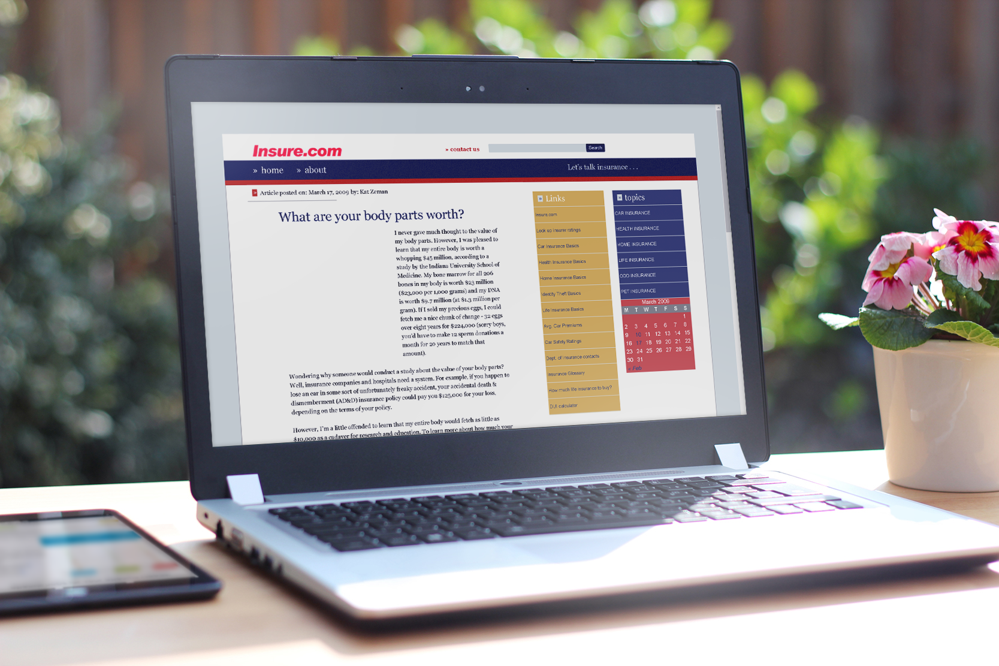

I joined Insure.com in January of 2008 where I had was originally bought on as a help desk administrator. One of my tasks was to take Microsoft Word documents sent over from our Editorial team and to update our Website with the contents of the document.

Updating the website was a very time consuming and labor heavy process. The Word documents would contain several versions with multiple edits that would then be copied into JSP files on our webserver. 

Due to the way the site was architected any file change required a full code deployment and webserver restart. The entire process was a days’ worth of work. If a last minute came in the entire process would have to start from the beginning.

When the IT team was looking into a stand-alone solution to manage editorial content on Insure.com I had suggested Wordpress as I was using it for a couple of personal projects at the time. It had document revision control, user roles and easily customizable. I was tasked with leading the migration of the old JAVA site to Wordpress.

I worked with the Editorial team to customize the content editing experience and trained them on how to manage their content. I Created custom Google Analytics reports for the marketing team and created custom document fields to manage SEO page data. The site had several 3rd party marketing tools that were integrated into the site and managed through custom plugins.

The Editorial team was able to bring 30 years’ worth of Insurance content online and the marketing team had a new lead channel with a lower acquisition cost and higher conversion rates. The Insure.com branding, content and website were sold in [October 2009 for $16 Million USD](https://techcrunch.com/2009/10/09/insure-com-sells-for-16-million/) which was the most expensive acquisition of a single domain at the time and still ranks in the top 10 as of July 2020.
